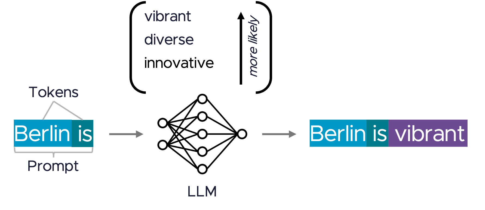
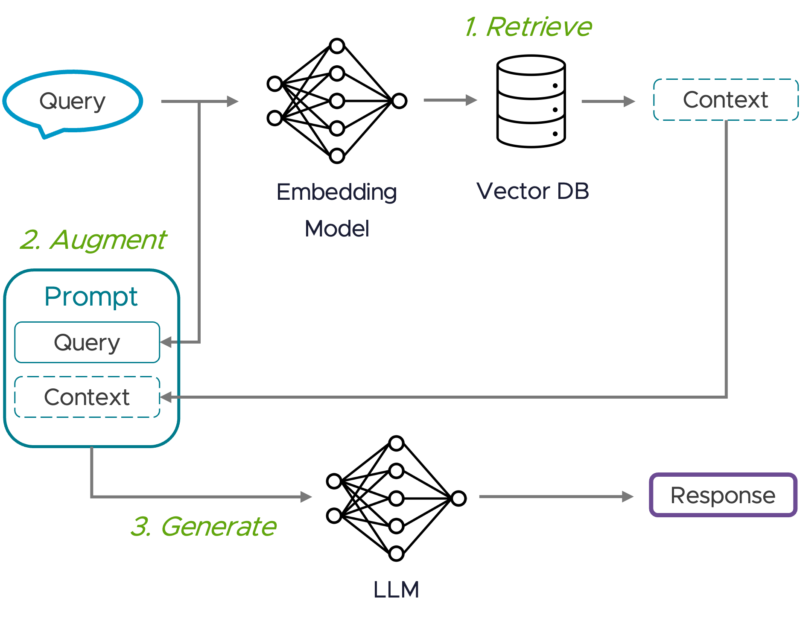

**Artificial Intelligence:** Machines are capable of performing cognitive functions typically associated with human minds.

**Machine learning:** Algorithms that learn from data to make predictions or decisions without being explicitly programmed. Types of ML: Supervised, Unsupervised, Reinforcement Learning, … 

**Deep Learning:** Algorithms that simulate how the human brain’s neurons work (Neural Networks).

**Generative AI** is capable of generating text, images, or other data by utilizing models that learn patterns and structure of their training data!

#### Models
**Machine Learning Model:**  A mathematical model trained on a specific dataset to make predictions or classifications on new data.

**Foundation Model:** An ML model trained on a huge amount of generic data that serves as the base for various generative tasks.

**Large Language Models (LLMs):** AI models specifically designed to understand and generate human language.
- *Prompts:* Input instructions or data given to the model to guide content generation.
- *Tokens:* Basic units of data processed by models, such as words or parts of words in text generation.

LLMs process a specific number of tokens at a time using complex mathematical calculations to predict the most likely next token in a sequence.

#### Adapting Foundation Models
**Fine-Tuning:** Further refining a model with specific data to improve its performance on a particular type of task ← requires significant computational resources.

**Prompt Engineering:** Designing effective input prompts to guide a generative model's outputs (e.g. with Few-Shot Prompting, Chain-of-Thought Prompting, or In-Context Learning).

**Function Calling:** Allows you to register your own functions to connect the model to the APIs of external systems.

**Retrieval-Augmented Generation (RAG)** enhances the output of models by incorporating relevant external information from external data sources.

